# A learner at every stage — screenshot evidence (lane L1)

Captured by `apps/app/scripts/capture-lived-in.mjs` from the real
`expo export --platform web` output, in Chromium, at 1100 px wide, with
the viewport grown to each screen's own scroll height so the whole surface is
laid out before it is framed.

**Every stage in these pictures is generated, not seeded.** The events were
minted by `@bunki/domain`'s own factories, the evidence-class ones by the
evidence gate that is their sole factory, judged by `admitToScheduler`, and
scheduled by the pinned memory model. The log replays to the same state the
generator folded forward, exports, and verifies — see
`packages/domain/test/demo/` and `packages/export/test/scripted-learner-export.test.ts`.
The learner is invented; the ledger is not.

Every URL pins the end date (`demoToday=2026-07-29`), so this script produces the
same pictures on any day it is run.

Scope: Chromium on Expo Web, one engine, on a build machine. No phone, no other
browser, no assistive technology (REQ-GATE-03).

---

## One stage, six surfaces, one browser session

The flagship set is `month-8` — the plateau — loaded **once** and then walked
through the shell, so these six frames are six views of one log rather than six
screens that each happen to render. The strip is in every frame.

The strip reported: **Demonstration data — not your history · Month 8 — the plateau**

What the app measured about its own build, read out of its own panel:

```
Demonstration data — not your history · Month 8 — the plateau
Close
This is a demonstration learner, generated by a script. The events are real — minted by this build’s kernel, admitted or refused by its evidence gate, scheduled by its pinned memory model, and they replay and export like any others. The person is not. None of this is your history.
A demonstration is never written to this device and never survives a reload: refreshing this page puts you back in your own data. Nothing you do inside one can reach what you have captured yourself.
met 389 words
studying 500 contracts
answered 3,217 probes
forgotten 307 times
not counted 87 answers
met once, never studied 124 words
Sittings: 36 finished · 124 out of time · 10 left.
Contracts per capability, never averaged — reading 265, meaning 201, listening 29, production 5, writing 0.
Generated and folded into state in 1282 ms on this device (559 ms to write the events, 723 ms to replay them).
Day 3 · 三日目
Two evenings and a morning. Seven or so words met, a few kept, one sitting. Nothing has an interval yet and the map is nearly dark — which is what a real third day looks like.
Month 2 · 二ヶ月
The habit has taken. A few hundred contracts, the first lapses, one sitting left unfinished, and reading running well ahead of production — because production needs the rung this learner has barely used.
Month 8 — the plateau · 停滞 — showing now
Four months of intake, then four in which everything due is easy and nothing new enters. The queue still empties every day and the map has stopped growing — the plateau, made visible instead of felt.
Year 2 · 二年目
Two years, including three months away and the return. Thousands of encounters, a long tail met once and never again, real decay, branch points opened by misses, and corrections in the ledger.
Your own data
Everything on screen is what you have captured and studied on this device. Nothing is simulated.
```

### The map — `month-8-map.png`

What has been built, counted off the ledger — “N of M contracts have evidence behind them”, one capability lens at a time, on the era ground. On an empty install this line reads “nothing built yet”; here it reads the plateau.

The strip in this frame reads: **Demonstration data — not your history · Month 8 — the plateau**

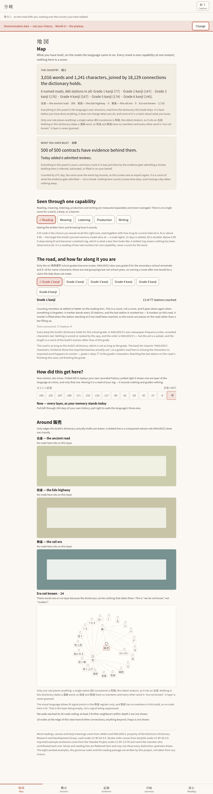

### The sitting — `month-8-session.png`

A finite plan over contracts the pinned model had already made due, with an explicit end. On an empty install this screen says nothing is on an active rung; here it has a target the scripted learner promoted.

The strip in this frame reads: **Demonstration data — not your history · Month 8 — the plateau**

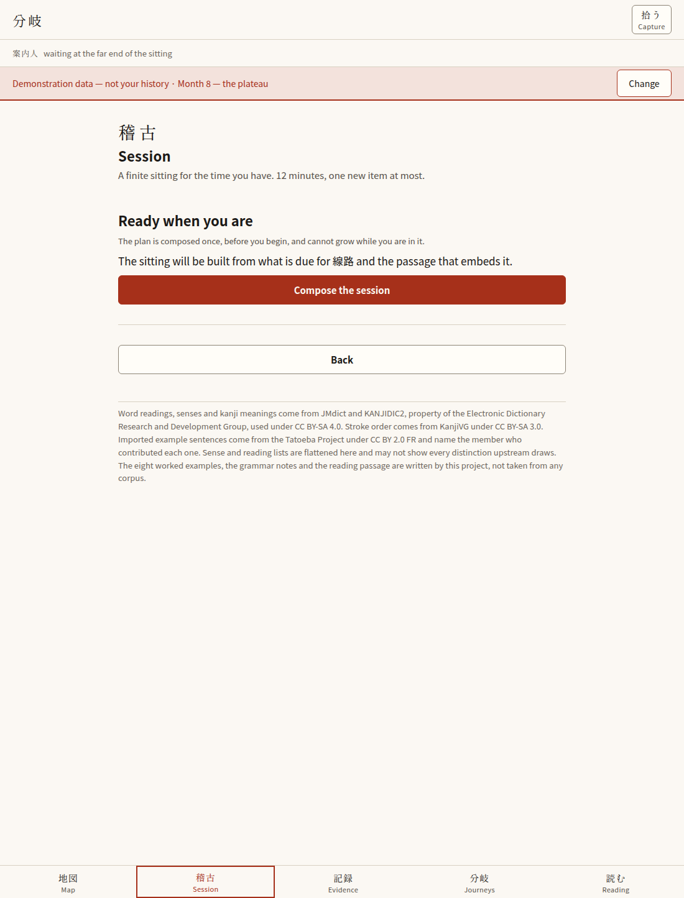

### The branches — `month-8-journey.png`

Branch points opened by misses the evidence gate counted — never declared by this script and never by the screen. On an empty install: “No branch is open.”

The strip in this frame reads: **Demonstration data — not your history · Month 8 — the plateau**

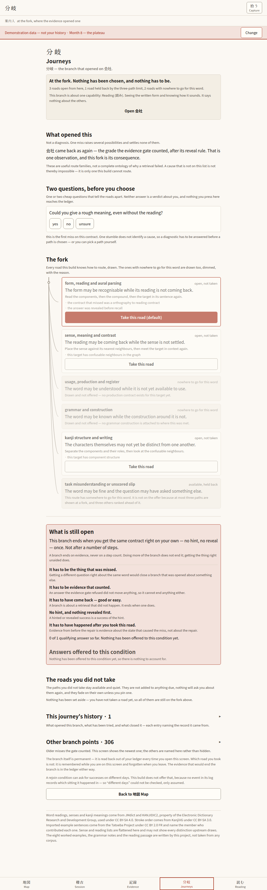

### The ledger — `month-8-evidence.png`

The chain behind one thread: what was observed, what the gate decided, and why the refusals did not count. This is the surface that is worth nothing without a populated state.

The strip in this frame reads: **Demonstration data — not your history · Month 8 — the plateau**

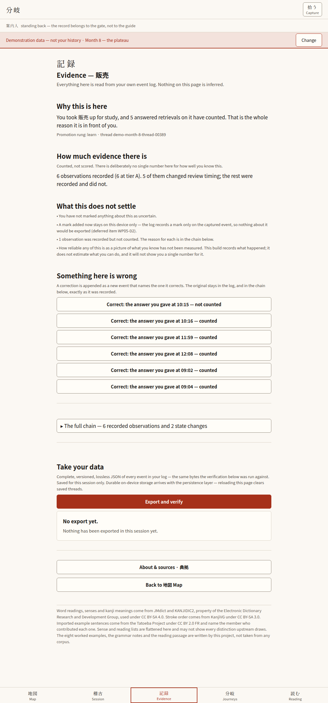

### Reading — `month-8-reading.png`

The one shipped passage, with the quiet marks on this learner’s own frontier rather than a global level rainbow (frozen §10.4).

The strip in this frame reads: **Demonstration data — not your history · Month 8 — the plateau**

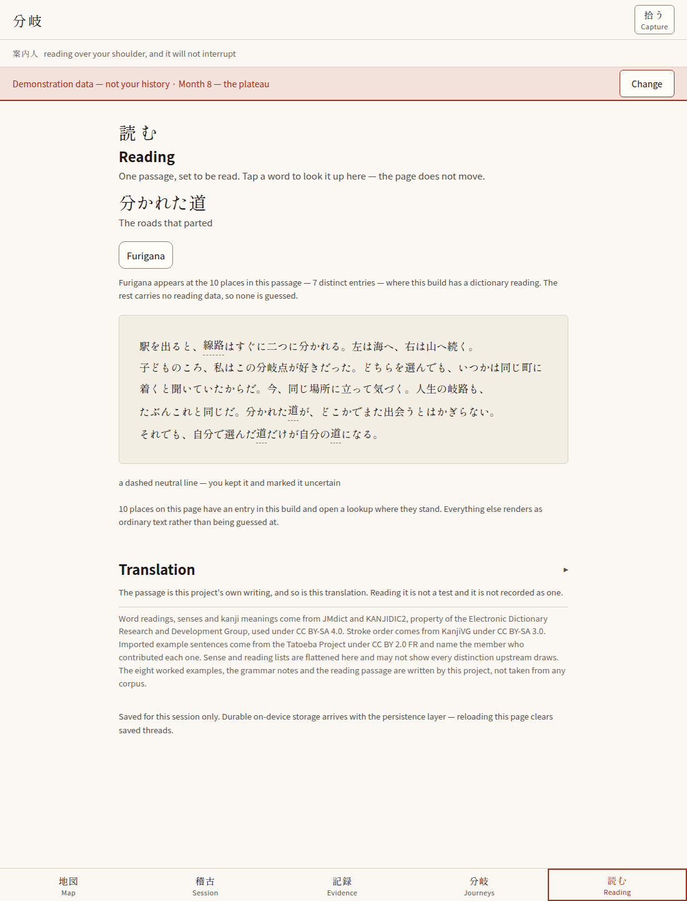

### The fractal dive — `month-8-dive.png`

Reached by tapping a kanji on the map, in the same session. Scale as an axis: the same node graph at word, kanji and component depth, with the learner’s own marks on it. Flying it is exposure and writes nothing (T-08); the frames here are of a surface that has something to be bright and dim about.

The strip in this frame reads: **Demonstration data — not your history · Month 8 — the plateau**

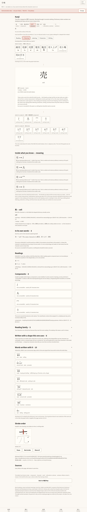


### The same map in the dark scheme — `month-8-map-dark.png`

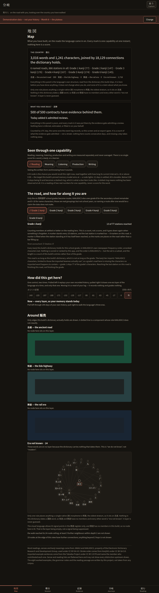

---

## Four stages, four different learners

One frame of the map each, because the map is the surface that answers "what
have I built". The stages differ in kind rather than in count — the day-3
learner has nothing settled, the month-8 learner has stopped taking anything
new, and the year-2 learner has been away and come back.

### day-3 — `stage-day-3-map.png`

The map's own line: **7 of 9 contracts have evidence behind them.**

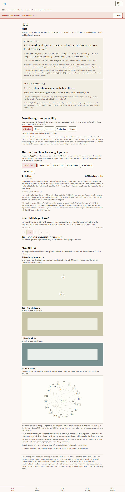

### month-2 — `stage-month-2-map.png`

The map's own line: **251 of 306 contracts have evidence behind them.**

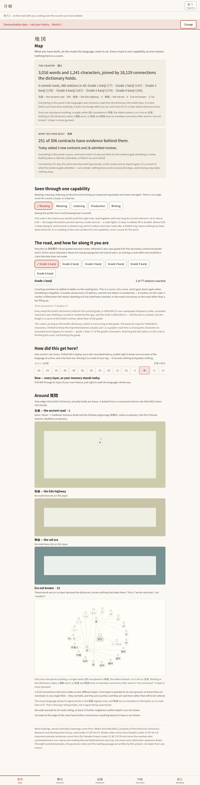

### month-8 — `stage-month-8-map.png`

The map's own line: **500 of 500 contracts have evidence behind them.**


### year-2 — `stage-year-2-map.png`

The map's own line: **885 of 889 contracts have evidence behind them.**

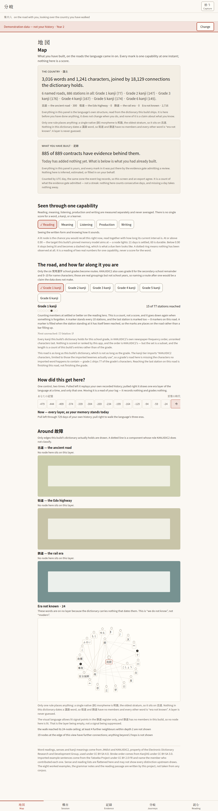


---

## …and the state a demonstration is never confused with

`own-data-map.png` is the same route with nothing loaded. The strip reads
**Your own data**, and the map says what is true of a fresh install.

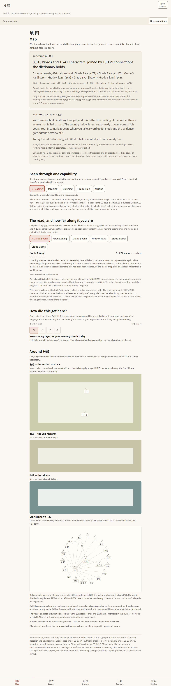
