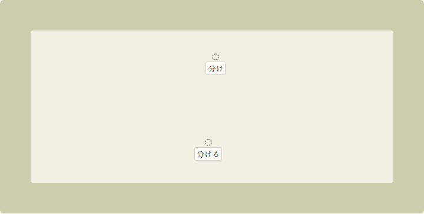
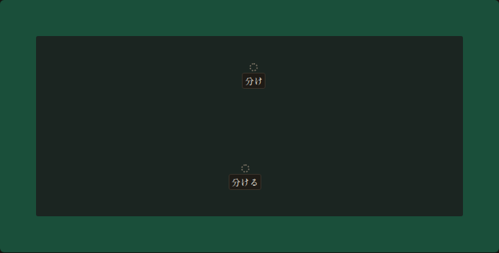
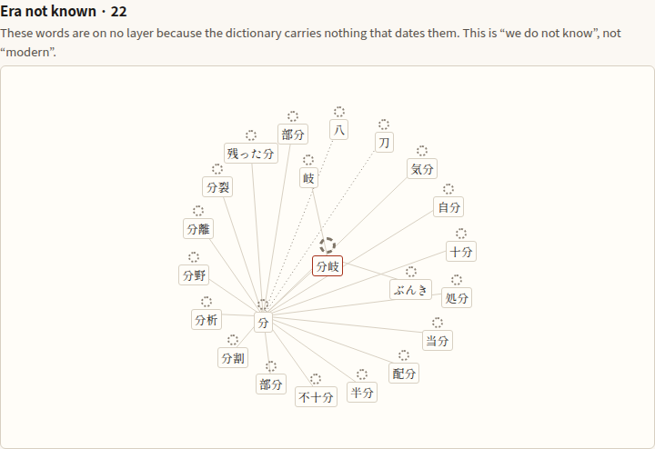
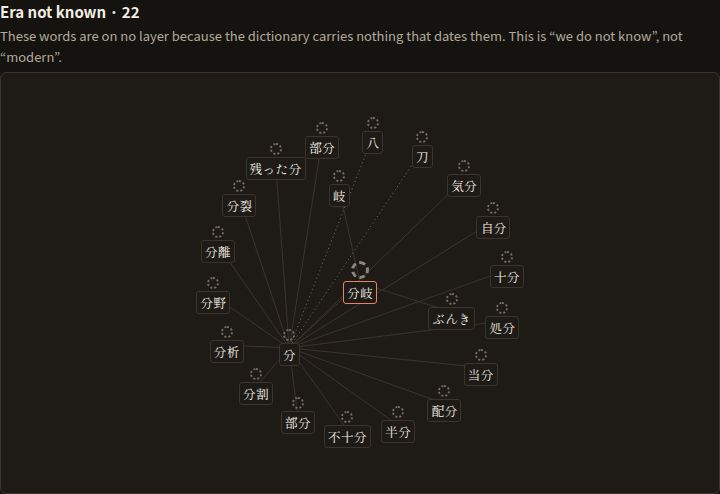
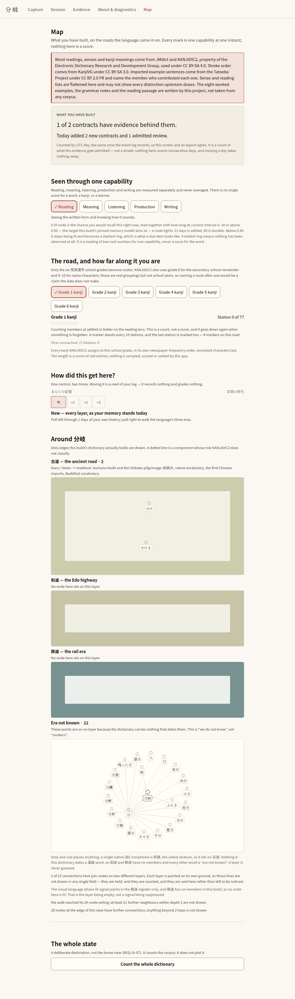
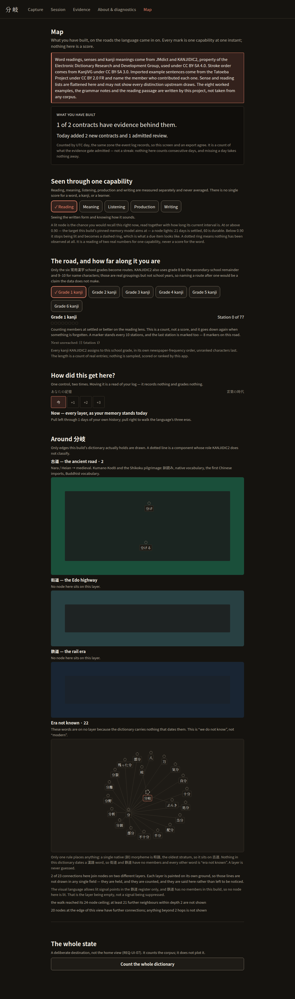

# The map — screenshot evidence (Campaign E, lane B1)

Captured by `apps/app/scripts/capture-map.mjs`, which serves the real
`expo export --platform web` output over HTTP and drives `/map` in Chromium
at 1100 px wide, growing the viewport to the screen's own scroll
height so every band is laid out before it is framed. The run fails if the
page throws or logs an error, so these images cannot be of a broken screen.

## The four bands

Three era layers and one state that is not a layer. **街道 and 鉄道 are
photographed empty, and that is the finding rather than a gap.** Lane A2′
measured that 9.8% of the dictionary can be placed and all of it lands on
古道; nothing in the data dates a 漢語 word, so a rule that filled the other
two would be a guess. `unknown` is drawn on no era ground at all.

### 古道 `kodo`

The ancient road. The only layer this dictionary can populate: a single native (訓) morpheme is 和語, the oldest lexical stratum. Base 鳥の子 torinoko by day and 藍海松茶 ai-mirucha by night, under a 白緑 byakuroku mist wash.

| light | dark |
| --- | --- |
|  |  |

### 街道 `kaido`

The Edo highway. Rendered, and empty, and it says so on screen. 漢語 spans all three layers and nothing in this dictionary dates it, so no rule places a word here that would not be a guess.

| light | dark |
| --- | --- |
|  |  |

### 鉄道 `tetsudo`

The rail era. Same situation as 街道: real ground, no members, stated plainly. This is also the only register where emitted light is permitted, which in this build means no lit point can appear — there is nothing here to light.

| light | dark |
| --- | --- |
|  |  |

### — `unknown`

Not a road, and drawn on no era ground at all. A node whose era we cannot establish sits on a plain card, because defaulting it onto a layer is the guessed era the whole era module exists to refuse. Over this dictionary it is the largest band.

| light | dark |
| --- | --- |
|  |  |

## The whole screen

| light | dark |
| --- | --- |
|  |  |

## What the page said when it was photographed

Read out of the loaded DOM rather than retyped from the source, so these are
the strings a learner saw.

- routes offered: **6**
- standing: “1 of 2 contracts have evidence behind them.”
- today: “Today added 2 new contracts and 1 admitted review.”
- position on the road: “Station 0 of 77”
- scrubber: “Now — every layer, as your memory stands today”

## One node, five lenses — the no-collapsed-light rule, photographed

REQ-UI-07 forbids collapsing reading, meaning, listening, production and
writing into one mastery light. The way to *show* that rather than assert it
is to hold one node still, move the lens, and read what the node says about
itself each time. Below is the map’s own accessible name for the origin node
after each lens chip was pressed, taken out of the loaded DOM — so it is what
a screen reader would say, not what the source claims it would say.

| lens | what the node says |
| --- | --- |
| reading | 分岐 — Reading: Emerging, fragile, 0 hops away |
| meaning | 分岐 — Meaning: No evidence yet, 0 hops away |
| listening | 分岐 — Listening: No evidence yet, 0 hops away |
| production | 分岐 — Production: No evidence yet, 0 hops away |
| writing | 分岐 — Writing: No evidence yet, 0 hops away |

The five rows are **not** the same, and that is the rule holding: one
review was admitted, on one contract, for one skill, and only the lens
that skill belongs to has anything to report. The others read "No
evidence yet" rather than reading weak — the unknown-is-not-zero
distinction the projection is built around. `writing` has no contract
in this build at all and can never read anything else.

## The ledger these pictures were taken over

Before each capture the script walked the app’s own closed loop by
clicking: search 分岐, keep it, take it up for study, start the
session the promotion planned, and answer one declared probe. No store
was seeded and no event was written by this script — the evidence gate
minted every one of them, and the pinned scheduler produced the memory
state the map then draws. The session reported:

> 1 of 3 done · 1 answered · 0 skipped · About 4 min of the plan left.

So the counts and the marks below are over one real admitted review, on
one contract, for one lens. Every *other* lens on that node is still
unmeasured, and the map draws it as unmeasured — which is the
no-collapsed-light rule visible in a picture rather than asserted.

## Measured cost, in this browser

| scheme | cold load to interactive | lens change | scrubber step |
| --- | --- | --- | --- |
| light | 690 ms | 32.1 ms | 30.1 ms |
| dark | 736 ms | 24.5 ms | 27.2 ms |

**Cold load to interactive** is navigation start until the road has drawn,
which includes the one-off Atlas build over the whole shipped dictionary
(9,245 nodes). It is paid once per session.

**Lens change** and **scrubber step** are the two interactions that redraw
every node on screen, and they are the ones that would expose a per-frame
index rebuild — the defect lane A2 had to repair. Each is measured in the
page from the click to two animation frames later.

**These are Chromium on a build machine, not a phone.** They are a floor on
what a device will do, not a prediction of it. No device, no Safari, no
Firefox, and no screen reader was used for any of this.

