# The fractal dive — second-pass screenshot evidence (lane B2)

Captured by `apps/app/scripts/capture-dive-verify.mjs` from the real
`expo export --platform web` output, in Chromium, at
1100 px wide, by **flying the dive** — the camera presses a
ring member and waits for the path to change before it photographs. There is
no specimen page for a dive: the only way to see L1 is to be at L1.

This is a *second* set beside `screenshots-b2-dive/`. It exists because a
verification pass that reported on somebody else’s screenshots would be
reporting a check it did not run.

## What the live page said, per shot

Read out of the photographed page rather than written here. The cost line is
the dive’s own level-of-detail measurement; the motion line is the chrome
saying which of the two modes is running.

| shot | where | level-of-detail cost | motion mode |
| --- | --- | --- | --- |
| `light-l2-kanji.png` | 分 | This view materialised 44 nodes of the 9025 this build indexes, from 9 adjacency lists. The rest of the graph was not touched. | Each level flies in from the one before it. Turn on reduced motion in your system settings… |
| `light-l1-component.png` | 分 › 八 | This view materialised 143 nodes of the 9025 this build indexes, from 7 adjacency lists. The rest of the graph was not touched. | Each level flies in from the one before it. Turn on reduced motion in your system settings… |
| `light-l0-stroke.png` | 分 › 1/4 | This view materialised 3 nodes of the 9025 this build indexes, from 1 adjacency lists. The rest of the graph was not touched. | Each level flies in from the one before it. Turn on reduced motion in your system settings… |
| `light-l3-word.png` | 分 › 気分 | This view materialised 15 nodes of the 9025 this build indexes, from 6 adjacency lists. The rest of the graph was not touched. | Each level flies in from the one before it. Turn on reduced motion in your system settings… |
| `dark-l2-kanji.png` | 分 | This view materialised 44 nodes of the 9025 this build indexes, from 9 adjacency lists. The rest of the graph was not touched. | Each level flies in from the one before it. Turn on reduced motion in your system settings… |
| `dark-l1-component.png` | 分 › 八 | This view materialised 143 nodes of the 9025 this build indexes, from 7 adjacency lists. The rest of the graph was not touched. | Each level flies in from the one before it. Turn on reduced motion in your system settings… |
| `dark-l0-stroke.png` | 分 › 1/4 | This view materialised 3 nodes of the 9025 this build indexes, from 1 adjacency lists. The rest of the graph was not touched. | Each level flies in from the one before it. Turn on reduced motion in your system settings… |
| `dark-l3-word.png` | 分 › 気分 | This view materialised 15 nodes of the 9025 this build indexes, from 6 adjacency lists. The rest of the graph was not touched. | Each level flies in from the one before it. Turn on reduced motion in your system settings… |
| `stepped-light-l2-kanji.png` | 分 | This view materialised 44 nodes of the 9025 this build indexes, from 9 adjacency lists. The rest of the graph was not touched. | Your system asks for reduced motion, so the dive is stepped: each level arrives in place, … |
| `stepped-light-l1-component.png` | 分 › 八 | This view materialised 143 nodes of the 9025 this build indexes, from 7 adjacency lists. The rest of the graph was not touched. | Your system asks for reduced motion, so the dive is stepped: each level arrives in place, … |
| `stepped-light-l0-stroke.png` | 分 › 1/4 | This view materialised 3 nodes of the 9025 this build indexes, from 1 adjacency lists. The rest of the graph was not touched. | Your system asks for reduced motion, so the dive is stepped: each level arrives in place, … |
| `stepped-light-l3-word.png` | 分 › 気分 | This view materialised 15 nodes of the 9025 this build indexes, from 6 adjacency lists. The rest of the graph was not touched. | Your system asks for reduced motion, so the dive is stepped: each level arrives in place, … |

## The exposure boundary, witnessed in the browser

The durable snapshot (`localStorage["bunki-phase0"]`) was read before the
flight and again after it, in the same page, and the two are byte-identical.
Before: `null` — nothing had been written.
This script fails if they differ.

That is a weaker witness than `e2e/dive-exposure.spec.ts`, which keeps a word
first so the log is non-empty and the comparison cannot be trivially true.
Both are run; neither replaces the other.

## Page errors seen while photographing

Every one of the 13 errors below is React 19's minified
**#418 — a hydration mismatch**, one per page load. It fires on
`/kanji/:character` *and* on `/word/:lexemeId`, and on none of `/`,
`/style-guide`, `/evidence` or `/session`, so it tracks the
dynamic-segment route shape rather than this lane. React recovers by
discarding the server markup and rendering on the client, which is why
every shot above is a real page.

**The cause was not established and it is not fixed here.** It is
recorded because a page error nobody wrote down is a page error that
ships.

## What to look for

- **The vocabulary does not change with depth.** The ladder, the path, the
  way out, the lens row and the interior strips are in every shot. There is
  no mode, and no control appears at one level and not another.
- **The layout follows the real graph.** No mirror symmetry, and no line
  between two ring members — the only connector drawn is the centre-to-ring
  rule, which is an edge every member actually has.
- **An empty level says so.** The dashed panels carry the domain’s own
  sentence about *why* a level is empty. L4 連語 is empty in every build this
  repository can produce and the page says that rather than leaving a blank.
- **The interior strip under each node is the diagnosis.** A lit node above a
  row of dark marks is a whole-word memory without a component memory.
- **Luminance is recall, form is fragility, hue is attention.** The only
  accent on the page marks where you are on the ladder.
- **The stepped variant is the same page.** Compare `stepped-light-*` with
  `light-*`: the difference is the motion note and the absence of a flight,
  not a second rendering.

## light-l2-kanji.png — L2 漢字 — the landing

- Variant: light

## light-l1-component.png — L1 部首 — one zoom inward, to a shape

- Variant: light

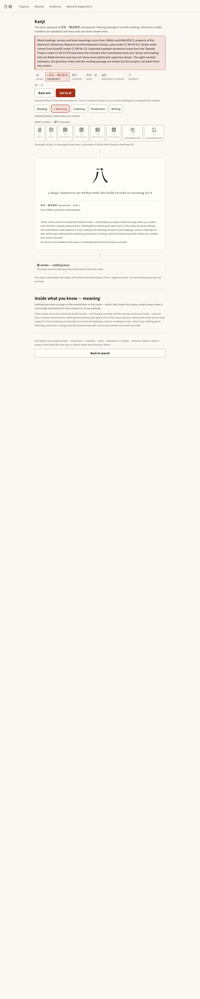

## light-l0-stroke.png — L0 画 — one zoom inward, to a single stroke

- Variant: light

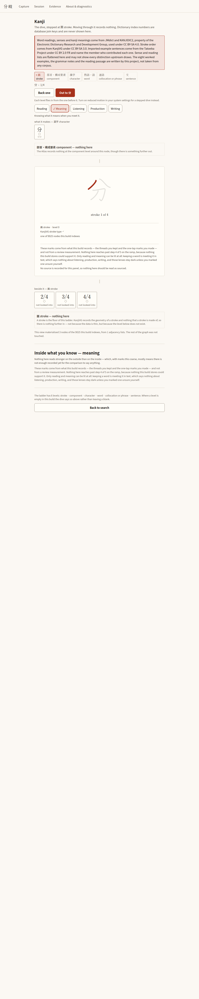

## light-l3-word.png — L3 熟語 — one zoom outward, to a word

- Variant: light

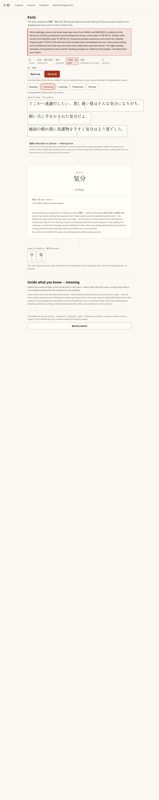

## dark-l2-kanji.png — L2 漢字 — the landing

- Variant: dark

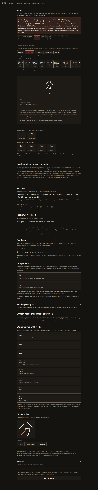

## dark-l1-component.png — L1 部首 — one zoom inward, to a shape

- Variant: dark

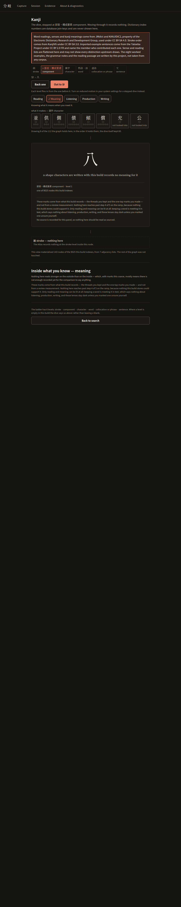

## dark-l0-stroke.png — L0 画 — one zoom inward, to a single stroke

- Variant: dark

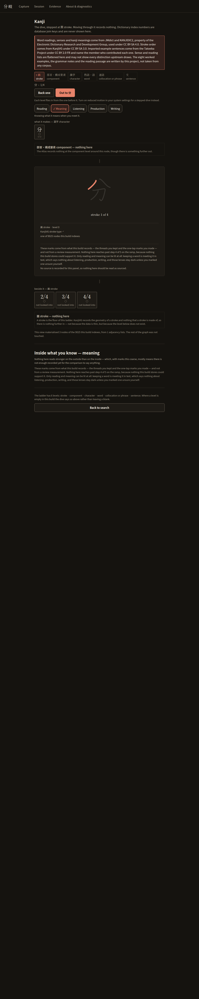

## dark-l3-word.png — L3 熟語 — one zoom outward, to a word

- Variant: dark

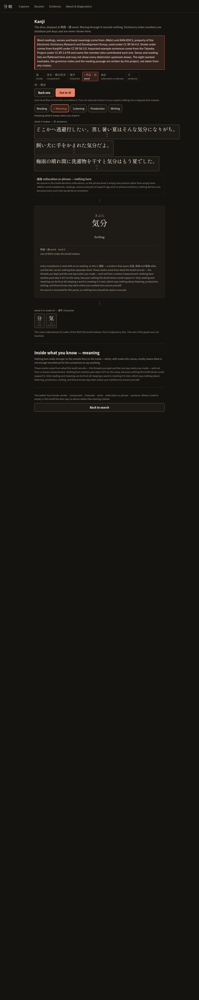

## stepped-light-l2-kanji.png — L2 漢字 — the landing

- Variant: stepped-light

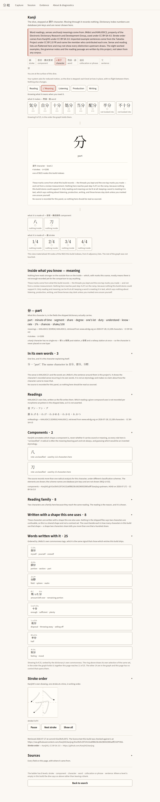

## stepped-light-l1-component.png — L1 部首 — one zoom inward, to a shape

- Variant: stepped-light

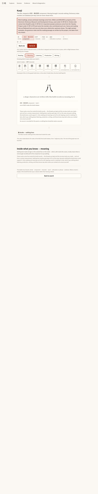

## stepped-light-l0-stroke.png — L0 画 — one zoom inward, to a single stroke

- Variant: stepped-light

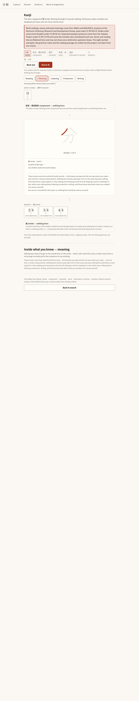

## stepped-light-l3-word.png — L3 熟語 — one zoom outward, to a word

- Variant: stepped-light

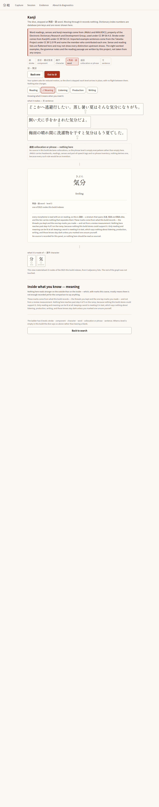

