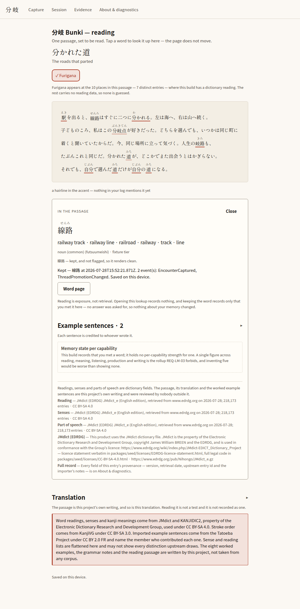
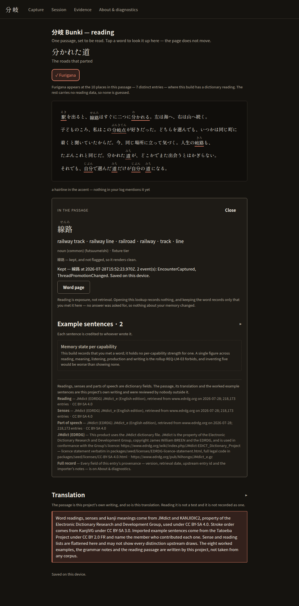

# Reading surface — screenshot and measurement evidence (Campaign E, lane B4)

Captured by `apps/app/scripts/capture-reading.mjs` from the real
`expo export --platform web` output, in Chromium, at 1100×1400, full page.

The page was **driven**, not merely opened: the script walks in through the
capture screen’s own door, turns furigana on, taps 線路 in the passage, and
keeps it. Every number below was read out of that page — the navigation
counters from patched `history` methods, the keep latency from the wall clock
between the click and the acknowledgement, the accessibility counts from
Chrome’s own tree over CDP. None of them is typed in by hand.

Scope: Chromium on the Expo Web export, on one machine. No other engine, no
assistive technology, and no mobile browser was involved.

## reading-light.png

- Scheme: light
- Fonts loaded: Noto Sans JP 400, Noto Sans JP 700, Shippori Mincho 400
- Navigations to open the lookup: 0
- Navigations to open the lookup **and** keep the word: 0
- URL before and after: `http://127.0.0.1:38547/read` → `http://127.0.0.1:38547/read`
- Keep latency, click to acknowledgement: 75 ms
- The store’s own acknowledgement: “Kept — 線路 at 2026-07-28T15:52:21.871Z. 2 event(s): EncounterCaptured, ThreadPromotionChanged. Saved on this device.”
- Passage as offered to a screen reader: 46 text nodes, 10 links, 0 words announced twice
- Marked words before the keep (10): 駅, new to you; 線路, new to you; 分かれる, new to you; 分岐点, new to you; 岐路, new to you; 道, new to you; 自分, new to you; 道, new to you; 自分, new to you; 道, new to you
- Marked words after the keep (9): 駅, new to you; 分かれる, new to you; 分岐点, new to you; 岐路, new to you; 道, new to you; 自分, new to you; 道, new to you; 自分, new to you; 道, new to you
- The passage on unbleached paper, furigana on, with the inline lookup for 線路 open underneath it and the word kept. The passage has not moved and the address bar has not changed — the counters under this shot are the proof.

## reading-dark.png

- Scheme: dark
- Fonts loaded: Noto Sans JP 400, Noto Sans JP 700, Shippori Mincho 400
- Navigations to open the lookup: 0
- Navigations to open the lookup **and** keep the word: 0
- URL before and after: `http://127.0.0.1:38547/read` → `http://127.0.0.1:38547/read`
- Keep latency, click to acknowledgement: 80 ms
- The store’s own acknowledgement: “Kept — 線路 at 2026-07-28T15:52:23.970Z. 2 event(s): EncounterCaptured, ThreadPromotionChanged. Saved on this device.”
- Passage as offered to a screen reader: 46 text nodes, 10 links, 0 words announced twice
- Marked words before the keep (10): 駅, new to you; 線路, new to you; 分かれる, new to you; 分岐点, new to you; 岐路, new to you; 道, new to you; 自分, new to you; 道, new to you; 自分, new to you; 道, new to you
- Marked words after the keep (9): 駅, new to you; 分かれる, new to you; 分岐点, new to you; 岐路, new to you; 道, new to you; 自分, new to you; 道, new to you; 自分, new to you; 道, new to you
- The same page and the same interaction in the dark scheme, which is designed rather than inverted. The frontier hairline is the one accent on the page; everything else is ink on ground.

