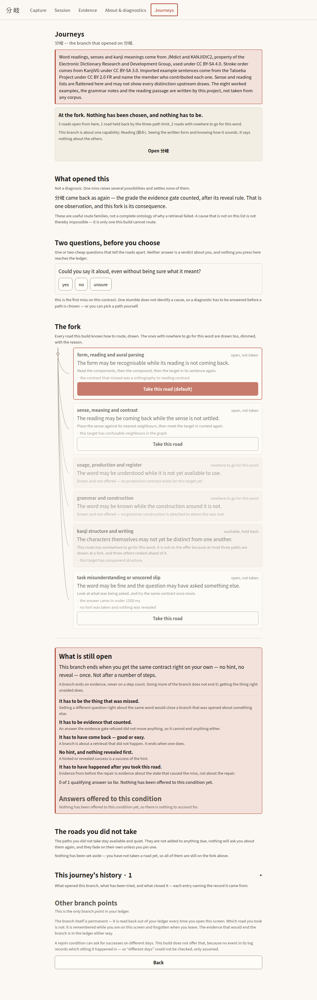
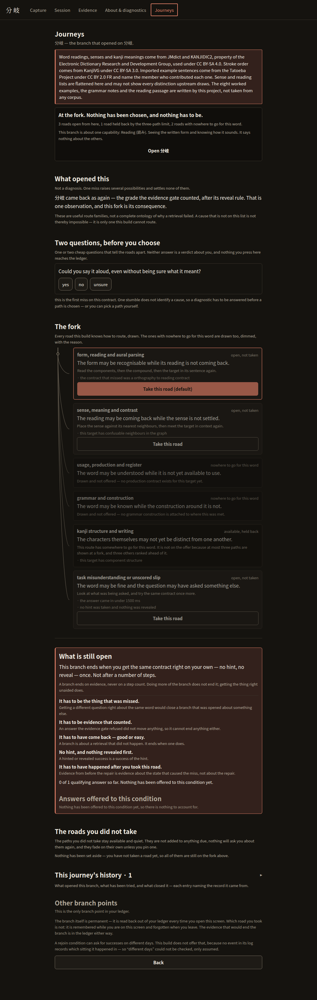
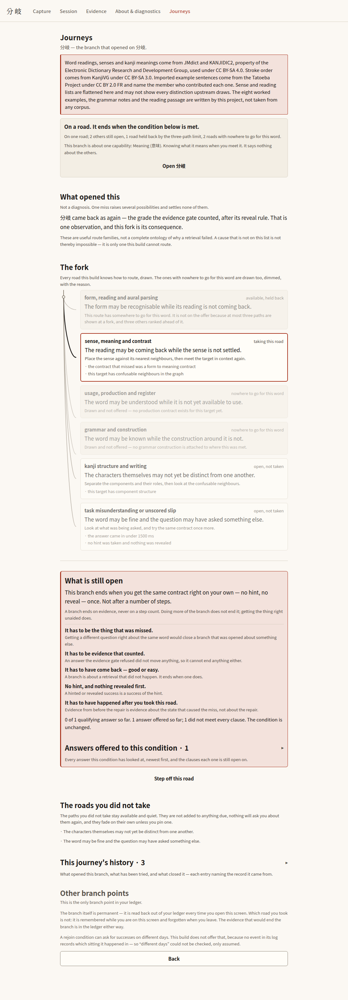
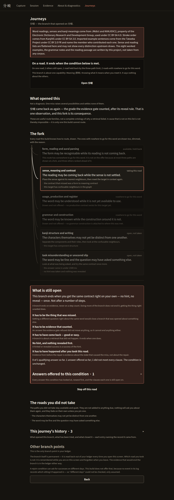
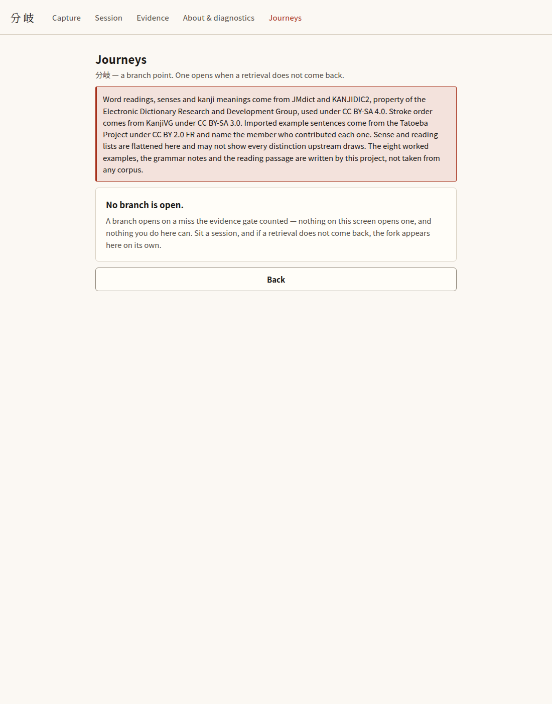
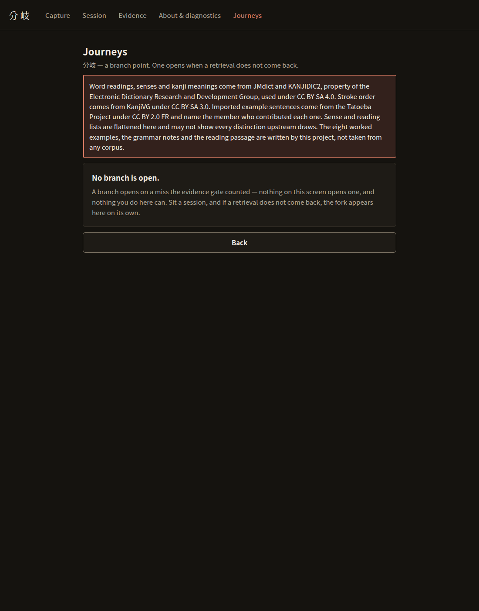

# Journeys — screenshot evidence (Campaign E, lane B5)

Captured by `apps/app/scripts/capture-journeys.mjs` from the real
`expo export --platform web` output, in Chromium, at 1100×1400, full page.

The four `journey-fork-*` / `journey-taken-*` shots were taken **after walking
the loop by clicking**: capture 分岐 → take it up for study → sit the session →
grade its first probe **Again**. That Again is the only thing in this app that
opens a branch, and the branch in these pictures is the kernel’s own — this
script grades nothing and seeds nothing.

The readout under each shot is taken from the photographed DOM, not from the
source, so "six rails are present" is a measurement rather than a claim.

## Why two shots of "the same" fork can differ

They are not the same fork, and the reason is a carried defect this evidence
found. `session-loop.ts` mints the reading and meaning contracts back to back
off the wall clock; `compareDueContracts` orders by due instant and falls back
to the contract id only on a tie. Two mints inside one millisecond therefore
probe **meaning** first, and two that straddle a millisecond boundary probe
**reading** first — so the miss lands on a different contract, the branch is
about a different capability, and the compiler offers a different set of
routes. Both forks are correct; which one you get is a race.

That is not this lane’s code to change. It is reproduced and pinned in
`apps/app/test/journey-surface.test.ts` under "carried defect", and the
**Capability line** below is recorded on every shot so each picture states
which contract its branch is about instead of leaving a reader to guess.

## journey-fork-light.png

- Scheme: light
- EDRDG acknowledgement present: true
- Fonts registered: Noto Sans JP, Shippori Mincho
- Phase line: `At the fork. Nothing has been chosen, and nothing has to be.`
- Capability line: `This branch is about one capability: Reading (読み). Seeing the written form and knowing how it sounds. It says nothing about the others.`
- Rails drawn (6), each with its state word:
  - form_reading_aural: open, not taken
  - sense_meaning_contrast: open, not taken
  - usage_production_register: nowhere to go for this word
  - grammar_construction: nowhere to go for this word
  - kanji_structure_writing: available, held back
  - task_misunderstanding: open, not taken
- SVG paths in the fork drawing: 7
- Open condition: `0 of 1 qualifying answer so far. Nothing has been offered to this condition yet.`

- The fork, after a real miss: 分岐 captured by clicking, taken up for study, its first probe graded Again. All six route families are drawn — the two on offer, the ones the three-path ceiling held back, and the ones with nowhere to go for this word, each carrying the compiler’s own reason. Nothing here was opened by a control; the evidence gate counted the miss.

## journey-fork-dark.png

- Scheme: dark
- EDRDG acknowledgement present: true
- Fonts registered: Noto Sans JP, Shippori Mincho
- Phase line: `At the fork. Nothing has been chosen, and nothing has to be.`
- Capability line: `This branch is about one capability: Reading (読み). Seeing the written form and knowing how it sounds. It says nothing about the others.`
- Rails drawn (6), each with its state word:
  - form_reading_aural: open, not taken
  - sense_meaning_contrast: open, not taken
  - usage_production_register: nowhere to go for this word
  - grammar_construction: nowhere to go for this word
  - kanji_structure_writing: available, held back
  - task_misunderstanding: open, not taken
- SVG paths in the fork drawing: 7
- Open condition: `0 of 1 qualifying answer so far. Nothing has been offered to this condition yet.`

- The same fork in the dark scheme, which is designed rather than inverted.

## journey-taken-light.png

- Scheme: light
- EDRDG acknowledgement present: true
- Fonts registered: Noto Sans JP, Shippori Mincho
- Phase line: `On a road. It ends when the condition below is met.`
- Capability line: `This branch is about one capability: Meaning (意味). Knowing what it means when you meet it. It says nothing about the others.`
- Rails drawn (6), each with its state word:
  - form_reading_aural: available, held back
  - sense_meaning_contrast: taking this road
  - usage_production_register: nowhere to go for this word
  - grammar_construction: nowhere to go for this word
  - kanji_structure_writing: open, not taken
  - task_misunderstanding: open, not taken
- SVG paths in the fork drawing: 7
- Open condition: `0 of 1 qualifying answer so far. 1 answer offered so far; 1 did not meet every clause. The condition is unchanged.`

- One road taken. It is lit; every other road is dimmed and still drawn, at an opacity floored by MIN_UNLIT_OPACITY so an untaken rail can never disappear. The open condition below states, before it is met, exactly what would end this branch.

## journey-taken-dark.png

- Scheme: dark
- EDRDG acknowledgement present: true
- Fonts registered: Noto Sans JP, Shippori Mincho
- Phase line: `On a road. It ends when the condition below is met.`
- Capability line: `This branch is about one capability: Meaning (意味). Knowing what it means when you meet it. It says nothing about the others.`
- Rails drawn (6), each with its state word:
  - form_reading_aural: available, held back
  - sense_meaning_contrast: taking this road
  - usage_production_register: nowhere to go for this word
  - grammar_construction: nowhere to go for this word
  - kanji_structure_writing: open, not taken
  - task_misunderstanding: open, not taken
- SVG paths in the fork drawing: 7
- Open condition: `0 of 1 qualifying answer so far. 1 answer offered so far; 1 did not meet every clause. The condition is unchanged.`

- The same taken road in the dark scheme.

## journey-empty-light.png

- Scheme: light
- EDRDG acknowledgement present: true
- Fonts registered: Noto Sans JP, Shippori Mincho
- Empty state: `No branch is open. A branch opens on a miss the evidence gate counted — nothing on this screen opens one, and nothing you do here can. Sit a session, and if a retrieval does not come back, the fork appears here on its own.`

- A cold browser. No branch is open, because nothing has been missed — and the empty state says that nothing on this screen can open one.

## journey-empty-dark.png

- Scheme: dark
- EDRDG acknowledgement present: true
- Fonts registered: Noto Sans JP, Shippori Mincho
- Empty state: `No branch is open. A branch opens on a miss the evidence gate counted — nothing on this screen opens one, and nothing you do here can. Sit a session, and if a retrieval does not come back, the fork appears here on its own.`

- The same empty state in the dark scheme.

