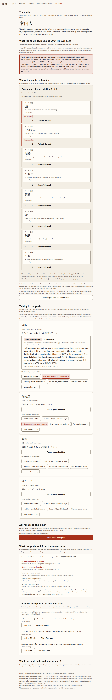
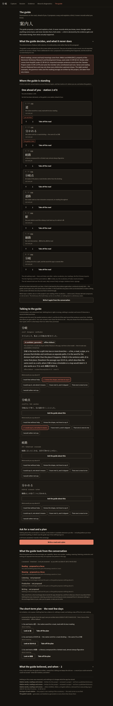

# The 案内人 — screenshot evidence (Campaign E, lane B6)

Captured by `apps/app/scripts/capture-guide.mjs` from the real
`expo export --platform web` output, in Chromium, at 1100×1400, full page.

The page was **driven**, not posed: the script asks the guide about the
first word, answers two turns, and asks for a road and a plan. The
`observed` block under each shot is read back out of the photographed DOM
after the shot, so it is evidence about the picture rather than a caption
written beside it.

Note what the labels line has to contain. A web export carries no API key
by construction, so the guide’s words came from the scripted fixtures and
must show **both** labels — the generated-content one and the
`offline-fallback` one. A build that had lost the second would still show
the first.

## guide-light.png

- Scheme: light
- The guide standing one station ahead on an eight-station road across the three era layers, after a two-turn conversation. The guide’s words carry both labels — “AI candidate / generated” and “offline-fallback” — because a web export holds no key and this text came from the app’s own fixtures.

```json
{
  "headline": "One ahead of you · station 2 of 8",
  "learner": "You are at station 1 of 8.",
  "labels": [
    "AI candidate / generated",
    "offline-fallback"
  ],
  "speechBlocks": 6,
  "roadRows": 8,
  "planProvenance": "proposed by the guide, from the app’s own pre-written text at 2026-07-28T17:44:41.377Z · from 2 turns of the conversation · offline-fallback"
}
```



## guide-dark.png

- Scheme: dark
- The same page, driven the same way, in the dark scheme. The two marks on the road are a rule and a word, never a colour alone.

```json
{
  "headline": "One ahead of you · station 2 of 8",
  "learner": "You are at station 1 of 8.",
  "labels": [
    "AI candidate / generated",
    "offline-fallback"
  ],
  "speechBlocks": 6,
  "roadRows": 8,
  "planProvenance": "proposed by the guide, from the app’s own pre-written text at 2026-07-28T17:44:45.515Z · from 2 turns of the conversation · offline-fallback"
}
```


