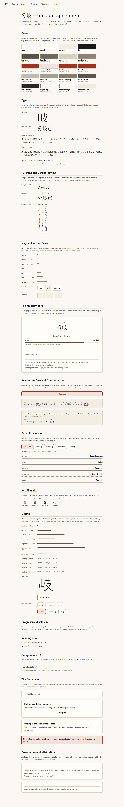
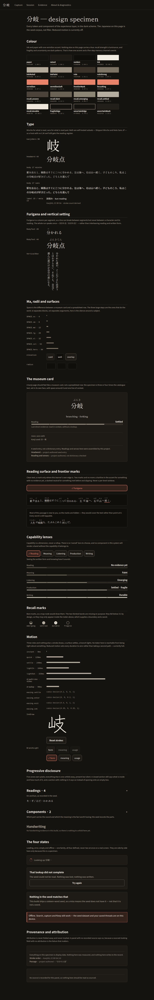

# Design specimen — screenshot evidence (Campaign E, lane A1)

Captured by `apps/app/scripts/capture-style-guide.mjs` from the real
`expo export --platform web` output, in Chromium, at 1100×1400, full page.

The `fonts` line under each shot is read out of `document.fonts` in the
photographed page, so it is evidence that the self-hosted faces really
registered rather than a claim that they were bundled.

## style-guide-light.png

- Scheme: light
- Fonts loaded: Noto Sans JP 400, Noto Sans JP 700, Shippori Mincho 400
- The whole vocabulary on unbleached paper. Reading surfaces are Shippori Mincho, chrome is Noto Sans JP — both self-hosted subsets carried by the bundle, so this is what a machine with no CJK font installed sees.

## style-guide-dark.png

- Scheme: dark
- Fonts loaded: Noto Sans JP 400, Noto Sans JP 700, Shippori Mincho 400
- The same page in the dark scheme, which is designed rather than inverted: the recall ramp runs the other way because on a dark ground presence is light. Both schemes are asserted against WCAG AA in test/theme-contrast.test.ts.

