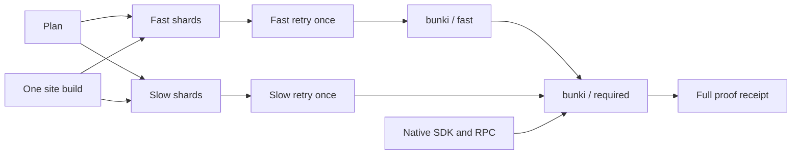

# Bunki CI design

Design recorded before implementation, 2026-10-06 JST. Targets are a trustworthy
first signal within 10 minutes, a full no-retry battery within 40 minutes, and an
identical-tree deployment within 10 minutes. These are targets until measured on
the PR; runner queue time and retries are reported separately.

## Execution plan

`batteryGates()` remains the canonical required set. Its commands, report
contracts, timeout cleanup, and assertions stay intact. `runGates()` continues to
execute gates and validate their reports. New orchestration selects subsets; it
cannot redefine what passing means. A parity command prints and compares the base
revision's names with the candidate's names. Missing names fail. Supplemental
checks preserve stronger assertions found outside the current 135-gate battery.

The workflow starts planning, the fast lane, build, and the single macOS native
job without the old native-before-Linux dependency. Independent matrix jobs use
`fail-fast: false`. Each gate has exactly one execution home in a full attempt.

Fast checks and their single permitted retry run independently of the slow
battery. `bunki / fast` reports a decisive early result after those checks;
`bunki / required` waits for both paths and the native checks. Initial failures
remain visible in shard summaries and annotations. An early fast receipt has
kind `bunki-fast-signal` and cannot authorize publication.

The fast lane owns format, lint, Corridor lint, official-content guard, typecheck, unit tests, short
contract verifiers, and the frozen deck no-diff checks. These gates are removed
from the slower matrix, not repeated. The deck check retains private and public
profiles, frozen IDs, tracked-output and untracked-output checks, the existing
`.apkg` exception, Python assertions, and deck/player tests with their pinned
Python dependencies installed.

| Linux work                     |                                           Initial prediction | Scheduling                                          |
| ------------------------------ | -----------------------------------------------------------: | --------------------------------------------------- |
| Fast checks                    |                                          Under 10 min target | Parallel early lanes if measured sum exceeds budget |
| Practice history / WebKit      |                                                    15.98 min | Dedicated shard                                     |
| Practice history / Chromium    |                                                    12.10 min | Dedicated shard                                     |
| Remaining gates                | Approximately 14 min per shard before extracting fast checks | Ten duration-balanced shards                        |
| Build and packaged-asset smoke |                                            Measure on branch | Once, before artifact-dependent gates               |
| Native Swift and RPC           |                                            Measure on branch | One macOS job, parallel to Linux                    |

The initial 12-bin estimate uses the complete f938 log: 135 gates and 166.76
minutes between battery start and final gate completion. Longest-processing-time
allocation across 12 unrestricted bins predicts a 15.98-minute maximum; isolating
both history gates leaves about 13.87 minutes of average work in each remaining
bin. Five complete runs were recovered (163.23, 162.42, 166.76, 146.40, and 123.00
minutes); final checked-in weights use each gate's observed maximum and record
their provenance in CI_MAP. Browser engines and dependency requirements are
explicit plan metadata. Unknown or new gates receive conservative weights, never
disappear. Timings change allocation only, never required membership.

Cold setup, artifact transfer, and supplemental gates need headroom under the
40-minute target. Step timeouts must exceed twice their measured healthy duration;
the existing 20-minute gate default needs a scoped increase for 16-minute history
verification. Gate timeouts and job timeouts are distinct. A retry may exceed the
ordinary 40-minute target and is reported honestly.

## Artifact and proof

Build the canonical site once for the candidate SHA. Preserve every existing
packaged-path, dictionary, licensing, archive, and source-cleanliness assertion.
Upload an immutable artifact with a unique run/attempt name and record its artifact
ID, `build-identity.json` SHA-256, and `artifactSha256` (which excludes that
manifest). Every artifact-dependent shard downloads
that artifact, verifies it before and after execution, and exports
`KAIRO_SITE_DIR`, `KAIRO_VERIFIED_ARTIFACT_SHA256`, and `KAIRO_ARTIFACT_SHA256`.
Each shard still verifies against its exact candidate checkout. Evidence lives in
`RUNNER_TEMP`; local evidence lives under `~/.dharma`.

A full receipt binds repository, candidate commit and Git tree, policy digest,
required-name digest, plan digest, run ID and attempt, site artifact ID and digest,
native/build/supplemental outcomes, gate attempts, and completion status. A
docs-only receipt explicitly has `scope: docs`; it is never full-battery proof.
The policy digest covers the workflow and verification implementation, not just
the list of gate names. Receipt filenames keyed by tree are indexes, not proof.

The only promotion is:

`ObservedGateResults + CompletePlan + MatchingArtifact + SuccessfulRequiredJobs`
`→ FullBatteryReceipt`.

Receipt JSON alone has no publication authority. The deploy controller must also
validate GitHub's producer run, repository, workflow path, terminal success,
attempt, artifact ownership and availability, and checked-out source identity.
It rejects a fork-produced receipt or a receipt from another workflow even if its
payload claims the correct tree. No downloaded program is executed with deploy
permissions. SHA-256 binds bytes; the workflow/run admission rule supplies trust.

## Deployment decision

`pages-app` remains the sole publisher, with its existing non-cancelling deploy
concurrency. On main, look for a successful full receipt from this repository's
canonical CI workflow whose verified tree equals main's tree and whose policy
matches. Resolve the producer commit through Git and independently compare both
tree hashes. Download the receipt and site by immutable artifact ID from that
admitted run. Missing, expired, malformed, or unauthenticated proof is a cache
miss: run the full sharded verification before publishing.

For PR runs, GitHub's API head SHA can differ from the checked-out merge SHA.
Admit a producer equal to the API head, or a producer merge commit whose parent
includes that head and whose tree equals the head's tree. Other relationships
fall back to full verification. Bind the producer checkout SHA in the receipt;
never mistake the API head alone for the tested merge checkout.

The reused site's original build identity is preserved. Existing
`verifyArtifact()` requires both checkout HEAD and `GITHUB_SHA` to match its
manifest; do not weaken that assertion globally. Reuse verifies bytes and source
against the producer checkout in a restricted verification job, after proving
producer-tree equals requested-main-tree. It emits a narrowly scoped transfer
receipt linking both commits and the exact artifact. The deployment job consumes
only the verified site and successful transfer/full receipt. Repackage it as the
current run's Pages artifact without rebuilding or editing the site.

No matching tree means no reuse. A failed fresh battery blocks deployment.
Docs-only PR success does not exempt a changed main tree from this rule.

## Retry and aggregation

First attempts retain their complete receipts even on failure. A planner extracts
failed gate names from complete, validated first-attempt receipts. One separate
GitHub-hosted job per affected shard runs only those gates on a fresh runner using
the same immutable site. Retry attempt 2 is the maximum. Missing/cancelled shards,
missing receipts, and invalid artifact identity are infrastructure failures, not
permission to infer a gate pass or invent a retry result.

A failed gate followed by a passing retry is **FLAKY**; two failures are red.
Retain both durations, runner identities, logs, and result details. A retry receipt
must contain exactly the planned failures. Extra retries, retried successes,
duplicate rows, and different artifact/run/plan identities fail admission.

Every job reads only its own attempt's plan, build, retry-plan and shard artifacts,
and receipts bind the run attempt. GitHub's **Re-run failed jobs** skips the
producers of those artifacts, so such an attempt always fails closed with missing
artifacts; it can never turn green by mixing attempts. The automatic single
fresh-runner gate retry happens inside every attempt. A manual rerun must use
**Re-run all jobs**; the aggregate summary of any failed later attempt says so.
The account-level rerun automation documented in CI_MAP will produce these
fail-closed attempts if it reruns failed jobs only. It is left unchanged until John
decides.

The committed `docs/ci/flakes.jsonl` starts with observed evidence only. After this
workflow lands on the default branch, `CI flake ledger` automatically appends new
observations to that path on the fixed data branch `ci/flake-ledger`. The producer
CI token remains read-only; the trusted consumer has contents-write and
actions-read. It never writes main or the tested candidate. The feature branch
contains the controlled-experiment seed; the data branch becomes the ongoing ledger.

The consumer observes exactly three same-repository producers of the one CI
pipeline: `ci.yml` (pull request or dispatch), `pages-app.yml` (push to main or
dispatch, jobs prefixed `verify / `) and `nightly-verify.yml` (schedule or dispatch,
jobs prefixed `full-battery / `). Each producer's workflow ID, path, event and exact
job prefix must match; other workflows, prefixes and forks are rejected. A deploy
or nightly retry is therefore recorded like a PR retry. These observations never
widen deployment proof, which still admits only `ci.yml` producers.

The consumer reads immutable shard artifacts, so a passing retry is recorded even
when another gate makes the run red. It verifies the producer repository/workflow,
attempt, actual Git policy blobs against its default-branch policy, archive digest,
complete reports, server job/runner identities and execution times. Downloaded
programs never run. These rows record observed producer reports and cannot issue
deployment proof. Policy-changing PR evidence waits until the trusted policy matches.

Writes use an isolated Git index, a fixed two-file data tree (ledger and processed-run
index), and ordinary fast-forward pushes. Existing ledger bytes are preserved;
identical observations do nothing and conflicts fail. Serialized workflow-run
consumers and hourly reconciliation inspect the retained 13-day window, processing
up to 20 attempts per invocation: the triggering attempt first, then never-tried
and least recently tried attempts. A retry job that was cancelled or failed before
its gate step has no report to pair, and neither does a bound retry report left
`running`, `interrupted` or `infrastructure-failed`; only that shard is skipped and
every other pair is still admitted in full. An attempt with no retry that reached its gates
has nothing to observe and is closed after reading its job list.

Each outcome is classified once. Observed attempts are final. An assertion about
immutable evidence (fork, wrong workflow or event, malformed or inconsistent
reports, policy mismatch, or evidence from another attempt) is a rejection recorded
against the trusted policy digest that judged it. It carries no timestamp and is
reconsidered only when that digest changes. Anything else (API, download or fetch
failures, or a report not yet listed for a completed gate step) is retried with
backoff doubling from one hour to a 24-hour cap, and never becomes an empty
observation. Missing or expired evidence produces warnings, never invented rows.
Scheduling entries are pruned 15 days after their attempt started, beyond the
14-day artifact retention, and only alongside a real write. Ledger rows are never
pruned.

The always-reporting `bunki / required` job independently computes expected jobs,
shards, and gate names from the selected scope. It rejects missing, cancelled,
never-run, pending, duplicate, unknown, malformed, and mismatched evidence. A
successful command cannot replace a complete report. All required native, build,
supplemental, first-attempt, and retry job outcomes are evaluated; intentional
docs-scope omissions and a genuinely empty retry plan are the only planned skips.
Whole-workflow cancellation may prevent the aggregator from running; it must
never create a successful check or reusable receipt.

Every run's summary lists gate, shard, duration, result, retry, evidence links,
total wall time, and the slowest ten gates. Step-level error capture permits
receipt upload, but only the aggregator can decide full success. A green retry
does not erase the red first attempt.

## Scope, consolidation, and caches

The PR workflow itself has no path filter. Its planner examines the complete diff
from the PR base, including deleted and renamed paths. A small explicit allowlist
of prose-only locations enables docs scope; build scripts under `docs/`, fixtures,
generated evidence, runtime assets, workflows, policy, locks, and unknown paths
require full scope. Diff/API failure also requires full scope. Docs scope always
runs the fast checks and aggregator. Dispatch and deployment default to full.

Move duplicate Corridor, reference, SKIP, personal-collection, and corpus checks
into their single CI homes before retiring their overlapping workflows. Preserve
unique syntax checks, standalone build assertions, personal host-bridge tests, and
the strongest deck checks as explicit supplemental gates. In particular preserve
all five personal-collection commands (including WebKit host verification),
`verify-experience --require-skip`, and the nightly Drift storage-integrity check.
Rewire nightly to the
same reusable full pipeline and remove its stale branch-push trigger; retain the
schedule pending John's decision. Keep historical Sites v11 verification and
manual preview separate because they exercise a different product. Keep
`pages-app` as the only workflow with Pages write authority. Its main concurrency
group remains `kairo-pages`; non-main proof-transfer experiments use separate groups.

Cache npm by lockfile, Playwright downloads by OS/architecture and package lock,
and pip by Python version plus dependency specifications. Browser system libraries
are still installed. Pin deck dependencies to fugashi 1.5.2, unidic-lite 1.0.8,
and genanki 0.13.1. Cached dependencies are not cached passing evidence.

## Implementation boundaries and proof

- `scripts/ci/battery.mjs`: deterministic plan, parity, shard execution,
  retry planning, aggregate admission, summary, and behavioral negative fixtures.
- `scripts/ci/receipts.mjs`: receipt lookup, GitHub producer admission, exact-tree
  reuse, immutable artifact selection, and transfer validation.
- Workflow files and release-gate workflow self-tests: preserve assertion intent
  while replacing old same-job topology assumptions with full-DAG requirements.

The plan/result interface carries schema version, scope, identity fields above,
shard IDs and ordered gate names. Runtime receipts use fresh directories. Parsing
is fail-closed; fixtures cover omitted/cancelled shards, a wrong artifact, an
unknown gate, an incomplete gate report, invalid retry membership, stale attempts,
docs receipts offered for deployment, and untrusted producer runs.

Before delivery, the draft PR must link actual branch runs proving wall time,
gate parity, a deliberate slow-gate assertion failure, cancellation rejection,
docs scope, and an intentional fail-once gate. Synthetic tests supplement those
runs; they do not substitute for them. Production runs remain untouched.

Questions for John, with safe defaults: enable branch protection requiring
`bunki / required` after evidence is green; keep the nightly full run. The
external rerun bot is investigated and documented, not disabled.

GitHub semantics: [job dependencies and conditional execution](https://docs.github.com/en/actions/reference/workflows-and-actions/workflow-syntax),
[immutable cross-run artifacts](https://docs.github.com/en/actions/tutorials/store-and-share-data),
and [artifact metadata](https://docs.github.com/en/rest/actions/artifacts).
